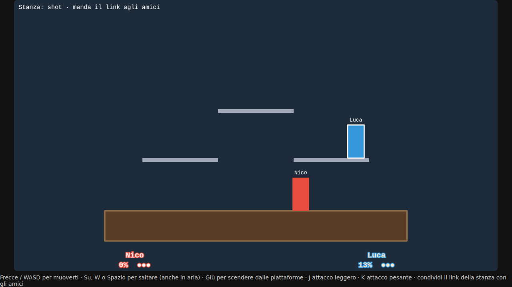

# Bonobo Game 🦍👊

**Il platform fighter multiplayer del nostro gruppo Discord**, nello stile di Brawlhalla e Smash Bros. Si gioca dal browser, senza installare niente: apri il link, mandalo agli amici e cercate di buttarvi giù dall'arena.



> Siamo agli inizi, ma le regole base ci sono già. La grafica sono rettangoli, quindi c'è spazio per tutti: grafici, programmatori, chi fa i suoni, chi inventa le mosse.

## Come si gioca

- Fino a 4 giocatori nella stessa stanza, ognuno con **3 vite**.
- I colpi non tolgono vita: fanno salire la tua **percentuale di danno**. Più è alta, più il prossimo colpo ti lancia lontano.
- Se vieni lanciato fuori dall'arena (oltre i bordi dello schermo) **perdi una vita** e rinasci dall'alto con la percentuale azzerata e un attimo di invulnerabilità.
- L'arena ha un palco principale solido e **piattaforme sottili** che si attraversano saltando da sotto. Con il **doppio salto** puoi rientrare quando ti hanno lanciato fuori.
- Vince l'ultimo con vite rimaste; dopo 5 secondi parte una nuova partita.

**Nuovo nel progetto?** Leggi [CONTRIBUTING.md](CONTRIBUTING.md): spiega passo passo come fare la tua prima modifica, anche se non hai mai usato Git.

## Tecnologie

- [Phaser](https://phaser.io) per la grafica e l'input nel browser
- [Socket.IO](https://socket.io) per il multiplayer in tempo reale
- [Node.js](https://nodejs.org) + Express per il server
- [Vite](https://vite.dev) per lo sviluppo (ricarica la pagina da sola quando salvi)
- Tutto in [TypeScript](https://www.typescriptlang.org)

## Comandi di gioco

| Azione | Tasti |
|---|---|
| Muoversi | ← → oppure A D |
| Saltare (premi di nuovo in aria per il doppio salto) | ↑, W oppure Spazio |
| Scendere da una piattaforma / caduta veloce | ↓ oppure S |
| Attacco leggero (veloce, spinge poco) | J |
| Attacco pesante (lento, lancia lontano) | K |

## Avviarlo sul tuo computer

Serve [Node.js](https://nodejs.org) 20 o più recente.

```bash
git clone https://github.com/nicpanozzo/bonobo-game.git
cd bonobo-game
npm install
npm run dev
```

Apri http://localhost:5173: l'indirizzo diventa tipo `http://localhost:5173/?room=ab12c`. Aprilo in una seconda finestra (o da un altro PC della stessa rete, usando l'IP che Vite stampa nel terminale) e vedrai due giocatori. Puoi scegliere il nome con `&name=Nico`.

`npm run dev` avvia due cose insieme:
- il **server di gioco** (porta 3000), che fa da arbitro e calcola la fisica;
- il **client** con Vite (porta 5173), che si ricarica da solo quando salvi un file.

Altri comandi:
- `npm run typecheck` controlla gli errori di TypeScript;
- `npm run build` compila il gioco in `dist/`;
- `npm start` avvia la versione di produzione (server + gioco compilato sulla porta 3000).

## Come è fatto

```
src/
  shared/      codice usato sia dal server che dal client
    constants.ts   arena, velocità, salti, attacchi, vite… i numeri del gioco
    physics.ts     movimento, piattaforme, colpi, knockback, vite (logica pura, niente grafica)
    types.ts       i messaggi che si scambiano client e server
  server/
    index.ts       server Express + Socket.IO, gestisce le stanze
    Room.ts        una partita: riceve i tasti, fa girare la fisica 60 volte al secondo, decide chi vince
  client/
    main.ts        avvia Phaser
    network.ts     connessione al server, stanza e nome dall'URL
    GameScene.ts   disegna i giocatori e manda i tasti premuti
```

Il principio chiave: **il server è l'arbitro**. Il browser manda solo quali tasti sono premuti, il server calcola dove sono tutti e chi ha colpito chi, poi manda lo stato a tutti 30 volte al secondo. Così nessuno può barare modificando il proprio client.

## Come contribuire

Versione breve qui sotto, quella completa (con i comandi spiegati uno per uno) è in [CONTRIBUTING.md](CONTRIBUTING.md).

1. Fatti aggiungere come collaboratore al repo GitHub (Settings → Collaborators).
2. Crea un branch per ogni cosa che fai:
   ```bash
   git checkout main && git pull
   git checkout -b nome/cosa-fai     # es. luca/sprite-personaggi
   ```
3. Fai le modifiche, prova con `npm run dev` e controlla `npm run typecheck`.
4. Fai commit e push, poi apri una Pull Request su GitHub:
   ```bash
   git add .
   git commit -m "Aggiunge gli sprite del personaggio"
   git push -u origin nome/cosa-fai
   ```
5. Un altro del gruppo dà un'occhiata e la unisce a `main`.

Regole semplici: PR piccole (una cosa alla volta), niente push diretti su `main`, scrivete nel canale Discord su cosa state lavorando per non pestarvi i piedi.

### Idee per iniziare

- **Grafica**: sostituire i rettangoli con sprite animati (fermo, corsa, salto, attacchi) in `GameScene.ts`.
- **Mosse**: attacchi direzionali (su, giù, in aria), schivata, una mossa di recupero verso l'alto (in `physics.ts` + `constants.ts`).
- **Arene**: altre disposizioni di piattaforme, sfondi, piattaforme che si muovono.
- **Personaggi**: armi o statistiche diverse (veloce ma leggero, lento ma pesante).
- **Telecamera**: zoom che segue i giocatori quando si allontanano.
- **Lobby**: schermata iniziale per scegliere nome, stanza e personaggio.
- **Suoni**: colpi, lanci, perdita di una vita, musica.
- **Rete più fluida**: predizione lato client per il proprio personaggio (la fisica in `shared/` è già pronta per girare anche nel browser).

## Metterlo online gratis

Il gioco è un unico server Node che serve sia la pagina sia il multiplayer, quindi basta un hosting che supporti Node e WebSocket.

**Render (consigliato per iniziare)**
1. Crea un account su [render.com](https://render.com) e collega GitHub.
2. New → Web Service → scegli il repo `bonobo-game`.
3. Build command: `npm install --include=dev && npm run build`
4. Start command: `npm start`
5. Piano Free. Dopo il deploy avrai un link tipo `https://bonobo-game.onrender.com/?room=amici` da mandare su Discord.

Nota: sul piano gratuito il server si addormenta dopo un po' senza visite e il primo accesso impiega circa un minuto a svegliarlo.

**Alternative**: [Fly.io](https://fly.io) e [Railway](https://railway.app) funzionano allo stesso modo (stessi comandi di build e start), con crediti gratuiti limitati. Per giocare solo una sera senza deploy, potete anche avviare `npm run dev` su un PC e condividerlo con un tunnel come `cloudflared tunnel --url http://localhost:5173`.
