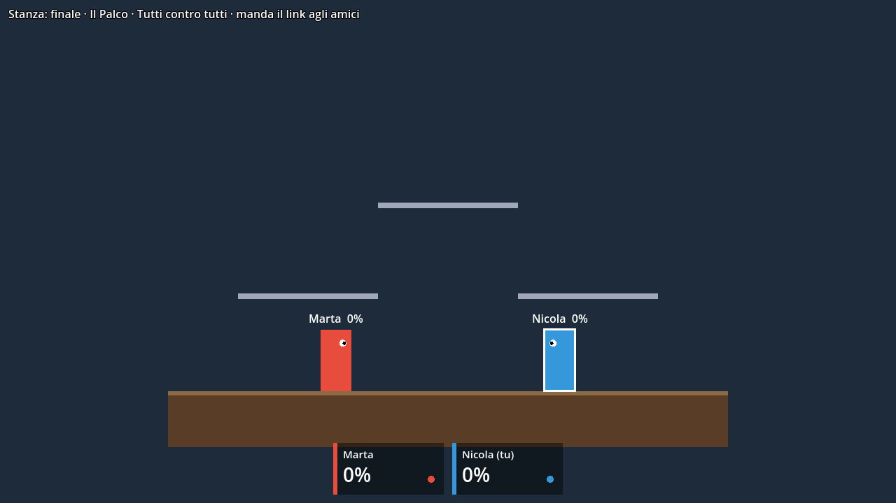

# Bonobo Game 🦍👊

**Il platform fighter multiplayer del nostro gruppo Discord**, nello stile di Brawlhalla e Smash Bros. È fatto con [Godot](https://godotengine.org) e si gioca anche dal browser, senza installare niente: apri il link, mandalo agli amici e cercate di buttarvi giù dall'arena.



> Dal 6 ottobre 2026 il gioco ufficiale è il client Godot in [`godot/`](godot/). Il server Node resta l'arbitro; il vecchio client web in `src/client/` non riceve più funzioni nuove.

> Siamo agli inizi, ma le regole base ci sono già. La grafica sono rettangoli, quindi c'è spazio per tutti: grafici, programmatori, chi fa i suoni, chi inventa le mosse.

## Come si gioca

- Fino a 4 giocatori nella stessa stanza, ognuno con **3 vite**.
- I colpi non tolgono vita: fanno salire la tua **percentuale di danno**. Più è alta, più il prossimo colpo ti lancia lontano.
- Se vieni lanciato fuori dall'arena (oltre i bordi dello schermo) **perdi una vita** e rinasci dall'alto con la percentuale azzerata e un attimo di invulnerabilità.
- L'arena ha un palco principale solido e **piattaforme sottili** che si attraversano saltando da sotto. Con il **doppio salto** puoi rientrare quando ti hanno lanciato fuori.
- Vince l'ultimo con vite rimaste; con R parte subito la rivincita.
- Nella lobby chi crea la stanza sceglie arena e regole: tutti contro tutti, squadre, Bandiera o Corsa.

**Nuovo nel progetto?** Leggi [CONTRIBUTING.md](CONTRIBUTING.md): spiega passo passo come fare la tua prima modifica, anche se non hai mai usato Git.

## Tecnologie

- [Godot 4.5](https://godotengine.org) (GDScript) per il gioco: grafica, suoni, menu. Si esporta per il web e per il computer.
- [Socket.IO](https://socket.io) per il multiplayer in tempo reale
- [Node.js](https://nodejs.org) + Express per il server, in [TypeScript](https://www.typescriptlang.org): regole e fisica stanno lì

## Comandi di gioco

| Azione | Tasti |
|---|---|
| Muoversi | ← → oppure A D |
| Saltare (premi di nuovo in aria per il doppio salto) | ↑, W oppure Spazio |
| Scendere da una piattaforma / caduta veloce | ↓ oppure S |
| Attacco leggero (veloce, spinge poco) | J |
| Attacco pesante (lento, lancia lontano) | K |
| Provocazione | T |
| Menu (opzioni, link della stanza, esci) | Esc |
| Musica accesa/spenta | M |

I tasti si cambiano da Opzioni.

## Avviarlo sul tuo computer

Servono [Node.js](https://nodejs.org) 22 e [Godot 4.5](https://godotengine.org/download) (la versione standard, non .NET).

```bash
git clone https://github.com/nicpanozzo/bonobo-game.git
cd bonobo-game
npm install
npm run dev
```

`npm run dev` avvia il **server di gioco** sulla porta 3000, che fa da arbitro e calcola la fisica (e, per confronto, il vecchio client web sulla 5173).

Poi apri Godot, **Importa** e scegli `godot/project.godot`, premi Play (F5): scegli nome, stanza e arena e premi **Gioca**. Per vedere due giocatori avvia due istanze (menu Debug, più istanze) o lancia da terminale `godot --path godot -- --room=amici --name=Nico` due volte.

Altri comandi:
- `npm run typecheck` e `npm test` controllano il server e la logica del gioco;
- `npm run export:godot` porta in Godot arene, personaggi, numeri e sprite da `src/shared/` e `public/assets/` (va rilanciato dopo averli cambiati);
- `godot --headless --path godot --export-release Web build/web/index.html` esporta la versione web.

## Come è fatto

```
godot/         IL GIOCO: client Godot, disegna e suona quello che manda il server
  scripts/       main (collegamento e tasti), world_view (arena e lottatori), hud, lobby, audio, opzioni, menu
  data/          arene, personaggi e numeri, generati da npm run export:godot
src/
  shared/      le regole del gioco, in TypeScript
    constants.ts   arena, velocità, salti, attacchi, vite… i numeri del gioco
    physics/       movimento, piattaforme, colpi, knockback, vite (logica pura, niente grafica)
    types.ts       i messaggi che si scambiano client e server
  server/
    index.ts       server Express + Socket.IO, gestisce le stanze
    Room.ts        una partita: riceve i tasti, fa girare la fisica 60 volte al secondo, decide chi vince
  client/      il vecchio client web (Phaser): congelato
```

Il principio chiave: **il server è l'arbitro**. Il gioco manda solo quali tasti sono premuti, il server calcola dove sono tutti e chi ha colpito chi, poi manda lo stato a tutti 30 volte al secondo. Così nessuno può barare modificando il proprio client. Più dettagli in [docs/architettura.md](docs/architettura.md) e [godot/README.md](godot/README.md).

## Come contribuire

Versione breve qui sotto, quella completa (con i comandi spiegati uno per uno) è in [CONTRIBUTING.md](CONTRIBUTING.md).

1. Fatti aggiungere come collaboratore al repo GitHub (Settings → Collaborators).
2. Crea un branch per ogni cosa che fai:
   ```bash
   git checkout main && git pull
   git checkout -b nome/cosa-fai     # es. luca/sprite-personaggi
   ```
3. Fai le modifiche, prova con `npm run dev` più Godot e controlla `npm run typecheck`.
4. Fai commit e push, poi apri una Pull Request su GitHub:
   ```bash
   git add .
   git commit -m "Aggiunge gli sprite del personaggio"
   git push -u origin nome/cosa-fai
   ```
5. Un altro del gruppo dà un'occhiata e la unisce a `main`.

Regole semplici: PR piccole (una cosa alla volta), niente push diretti su `main`, scrivete nel canale Discord su cosa state lavorando per non pestarvi i piedi.

### Idee per iniziare

- **Grafica**: sprite animati per ogni lottatore (fermo, corsa, salto, attacchi) in `public/assets/`, disegnati da `godot/scripts/world_view.gd`.
- **Mosse**: attacchi direzionali (su, giù, in aria), schivata, una mossa di recupero verso l'alto (in `src/shared/physics/` + `constants.ts`).
- **Arene**: altre disposizioni di piattaforme, sfondi, piattaforme che si muovono.
- **Personaggi**: armi o statistiche diverse (veloce ma leggero, lento ma pesante).
- **Telecamera**: zoom che segue i giocatori quando si allontanano (`godot/scripts/main.gd`).
- **Suoni**: le nostre voci e suoni registrati al posto di quelli sintetizzati (`godot/scripts/audio.gd`).
- **Rete più fluida**: predizione lato client per il proprio personaggio.

## Metterlo online gratis

Le parti sono due: il **server** Node (l'arbitro) e il **gioco** Godot esportato per il web.

- **Il gioco** si pubblica da solo su GitHub Pages a ogni merge su `main`: https://nicpanozzo.github.io/bonobo-game/godot/. Gli si dice quale server usare con l'indirizzo: `.../godot/?server=https://il-server&room=amici`. Il link giusto lo copia il gioco stesso (Copia link nella lobby o nel menu Esc).
- **Il server** gira su un PC con `npm run dev` (o `npm start`) e si condivide con un tunnel, per esempio `cloudflared tunnel --url http://localhost:3000`, oppure su un hosting che supporti Node e WebSocket come [Render](https://render.com) (build `npm install --include=dev && npm run build`, start `npm start`; sul piano gratuito si addormenta e il primo accesso impiega circa un minuto).
