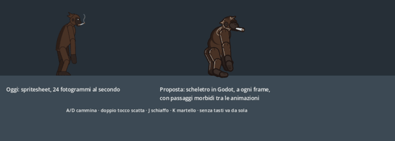

# Proposta: animare i lottatori in tempo reale in Godot

**Stato:** proposta di Riccardo (@GiovannifRana), **da decidere con il gruppo e con Nicola** ([#196](https://github.com/nicpanozzo/bonobo-game/issues/196)). Finché non c'è la decisione il gioco non cambia: la prova sta in `godot/prototipi/scheletro/` e il gioco non la usa.



*A sinistra lo spritesheet di oggi, a destra lo stesso personaggio con lo scheletro nuovo (#195), animato da Godot. La GIF va a 50 fotogrammi al secondo; nel gioco lo scheletro segue lo schermo, 60 o 144.*

## In breve

**Oggi:** in Blender si anima uno scheletro, si fanno le foto di ogni fotogramma (spritesheet) e Godot mostra le foto, 24 al secondo.

**La proposta:** Godot riceve lo scheletro, i pezzi disegnati e le chiavi dell'animazione, e calcola lui la posa a ogni frame dello schermo.

## Cosa si guadagna

| | Oggi (spritesheet) | Proposta (scheletro in Godot) |
|---|---|---|
| Fluidità | 24 pose al secondo, a scatti sugli schermi a 60 o 144 Hz | una posa per frame dello schermo |
| Passaggi tra animazioni | netti: da corsa a schiaffo si salta al primo fotogramma | morbidi, in 0,15 s si fondono (`AnimationPlayer.play(nome, 0.15)`) |
| Peso dei file | Bonobot con 11 animazioni: circa 1,6 MB di PNG, cresce con ogni animazione | 32 pezzi (circa 0,4 MB) più le chiavi in JSON (decine di KB per animazione) |
| Ritmo dei colpi | i fotogrammi sono fissi: se cambia `startupMs` si rifà il render | si stira l'animazione sui tempi di `ATTACKS`, senza rifare niente |
| Cose nuove possibili | no | testa che guarda l'avversario, piedi che seguono il terreno, colpi più forti più ampi, chroma dei colori sui pezzi, effetti attaccati alle ossa (nella prova il fumo della canna è fatto di particelle che salgono, si allargano e svaniscono) |
| Disegno definitivo | si rifà il render di tutte le animazioni | si sostituiscono i PNG dei pezzi, e in gioco cambia subito tutto |

## Cosa resta uguale

- **Il server e la fisica non cambiano:** posizioni, colpi e hitbox restano in `src/shared/physics/`. Lo scheletro è solo disegno, come oggi lo spritesheet.
- **Gli eventi** (`attack`, `hit`, `jump`...) e gli stati che Godot sceglie dallo snapshot (`_animation_for` in `world_view.gd`) restano quelli. Cambia solo cosa si disegna per ogni stato.
- **Blender resta lo strumento per animare.** `tools/blender/esporta_animazioni.py` (#195) scrive le chiavi, con le IK già calcolate.
- **Chi disegna a spritesheet può continuare.** I due formati convivono: chi ha `rig` usa lo scheletro, chi ha `sprite` come oggi. Egiainuso, Elvedeo e chi arriva in pixel art non devono cambiare niente.

## Cosa costa

1. **Un costruttore in Godot.** C'è già nella prova: `costruisci_scheletro.gd`, circa 120 righe, che legge `rig.json` e le animazioni.
2. **I dati in `game.json`.** `npm run export:godot` copia `rig.json`, i pezzi e le animazioni come fa oggi con gli sprite.
3. **`world_view.gd`** sceglie lo scheletro quando il personaggio ce l'ha. Poi passa da uno stato all'altro con la fusione, e per i colpi tiene il fotogramma d'impatto su `startupMs`, come `hitFrame` oggi.
4. **Tutte le animazioni di Bonobot sul nuovo scheletro.** È il lavoro più grosso, di Riccardo in Blender. Fino ad allora gli stati che mancano ripiegano come oggi (E7 passo 3).
5. **Prestazioni da controllare nella build web.** Sono 8 lottatori × circa 60 sprite (pezzi e contorni). Nella prova un lottatore non pesa, ma 8 nella build web vanno misurati prima di dire sì.

Stima: 3-4 PR piccole per il codice (passi 1-3), più il lavoro di animazione. Nessun cambio di protocollo.

## Rischi

- **Due formati da mantenere** in `world_view.gd` finché tutti i personaggi non passano. Con il ripiego è poco codice, ma è un caso in più da provare.
- **L'aspetto dipende dai pezzi.** Con pezzi rigidi si vedono le giunture se il disegno non le copre. La prova usa il contorno comune dietro al corpo e le giunture tonde: va guardata nel gioco vero, con la camera che zooma.
- **Le pose estreme** (capriola, rotolata) con pezzi rigidi a volte rendono peggio di un fotogramma disegnato apposta. Si possono tenere come fotogramma singolo anche nello scheletro, per esempio un PNG al posto della testa.

## Come provarla

```bash
godot --path godot res://prototipi/scheletro/prova.tscn
```

Tasti: A/D cammina, doppio tocco di A/D (o Maiusc) scatta a quattro zampe, J schiaffo, K martello. Senza tasti la prova gira da sola. La scena mette accanto Bonobot di oggi e quello con lo scheletro.

I file della prova:
- `godot/prototipi/scheletro/`: costruttore, scena, effetto del fumo (`fumo.gd`) e una copia dello scheletro con le animazioni;
- `tools/rig/genera_animazioni_prova.py`: le animazioni di prova (fermo, camminata, schiaffo, martello, scatto), scritte col codice. Mani e piedi dello scatto usano una IK a due ossa per appoggiarsi davvero a terra.

Nel gioco vero le animazioni arriverebbero da Blender.

## Da decidere

1. **Si fa?** Se sì, dopo il voto si apre l'evolutiva con i passi 1-3 qui sopra.
2. **Bonobot per primo**, e il personaggio predefinito, se il gruppo lo vuole, solo quando ha tutte le animazioni.
3. **I personaggi di Mauro** restano a spritesheet, finché lui non vuole cambiare.

Sondaggio proposto per il Discord, da lanciare con il permesso di Riccardo:

```bash
npm run discord -- poll "Animare i lottatori in tempo reale in Godot (scheletro e pezzi) invece che con gli spritesheet? Video e dettagli nella #196" "Sì, proviamo con Bonobot" "Sì, ma prima finiamo le animazioni a spritesheet" "No, restiamo agli spritesheet"
```
