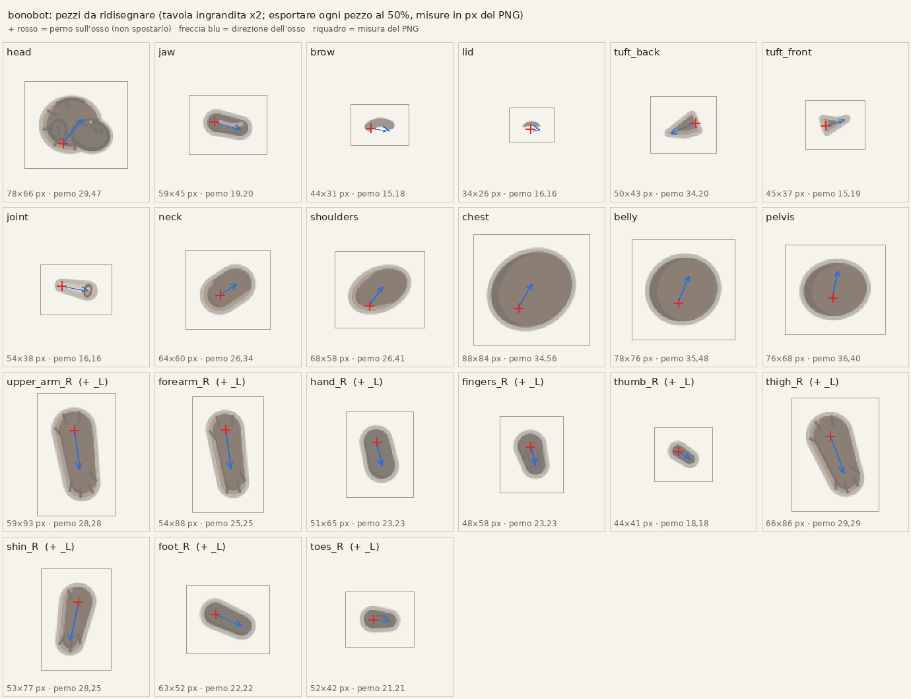

# Scheletro dei lottatori

Come sono costruiti i lottatori animati a pezzi (cutout) e come si passa allo scheletro più ricco (#195). Vale per Bonobot ed è il modello per gli altri. Lo stile dei disegni è in [stile-grafico.md](stile-grafico.md).

**Stato:** proposta di Riccardo (@GiovannifRana). Lo scheletro nuovo non cambia il gioco: in Blender si anima come oggi e si esporta lo spritesheet. Se il gruppo approva la proposta [#196](https://github.com/nicpanozzo/bonobo-game/issues/196), lo stesso scheletro si potrà animare direttamente in Godot.


## Perché più ossa

Oggi Bonobot ha 18 pezzi su 19 ossa: il busto si piega in un punto solo e mani e piedi sono blocchi unici. Con 35 ossa che deformano:

- il busto si piega in **tre segmenti**, con il collo a parte: respiro, rincorsa e colpi hanno una curva vera, non una cerniera;
- **mani** con dita e pollice e **piedi** con dita: le nocche si appoggiano nella corsa e il piede rulla nel passo;
- **faccia** con mascella, sopracciglio e palpebra: sbattere le ciglia, alzare il sopracciglio, la canna che si muove con la bocca;
- **ciuffi** e canna seguono i movimenti in ritardo (inerzia), senza animarli a mano;
- il **fumo** non è un pezzo disegnato: in `rig.json` c'è un effetto (`effects`, tipo `smoke`) attaccato alla punta della canna, e chi disegna lo fa con le particelle. Nella prova di #196 è `fumo.gd`. Le ossa `smoke_1` e `smoke_2` restano per chi vuole animarlo a mano in Blender;
- le catene di braccia e gambe hanno la **cinematica inversa (IK)**: si sposta la mano o il piede e gomito e ginocchio seguono, così mani e piedi restano piantati a terra.

## Le ossa

Tutte le ossa sono in [`rig.json`](../public/assets/characters/bonobot/rig/rig.json), con la posizione a riposo di testa e coda. `R` è il lato vicino a chi guarda, `L` quello lontano.

| Gruppo | Ossa |
|---|---|
| Corpo | `root` (ai piedi) → `hips` → `spine_1` → `spine_2` → `spine_3` → `neck` → `head` |
| Testa | `jaw` → `joint` (canna) → `smoke_1` → `smoke_2`; `brow`, `lid`, `tuft_back`, `tuft_front` |
| Braccia (×2) | `clavicle` → `upper_arm` → `forearm` → `hand` → `fingers`, `thumb` |
| Gambe (×2) | `thigh` → `shin` → `foot` → `toes` |
| Controlli (non deformano) | `ik_hand_R/L`, `ik_foot_R/L` (dove va la mano o il piede), `pole_arm_R/L`, `pole_leg_R/L` (da che parte si piegano gomito e ginocchio) |

Totale: 35 ossa che deformano più 8 controlli.

## Convenzioni

- **Coordinate del disegno:** pixel a 2x, origine ai piedi al centro, y in giù, il personaggio guarda a destra. Nel gioco si mostra a metà (`scale: 0.5`).
- **Nomi:** in inglese, `snake_case`, lato in fondo (`_R` vicino, `_L` lontano). Ogni pezzo porta il nome del suo osso.
- **Un pezzo per osso, al massimo.** Il pezzo copre la giuntura con una forma tonda, così ruotando non si apre un buco.
- **Contorno a inchiostro in un livello a parte:** ogni pezzo ha `nome.png` (colori) e `nome_ink.png` (sagoma nera un po' più grande).
  - I pezzi del corpo e del lato lontano mettono il contorno in un livello comune dietro a tutto. Così il personaggio ha **una sola sagoma esterna** e nel busto non si vedono giunture.
  - La canna è un cono, stretto in bocca e largo in punta, con la brace.
  - Braccio e gamba vicini, sopracciglio, palpebra e canna hanno il **contorno proprio**, subito dietro al pezzo, perché passano davanti al corpo.
  - In `rig.json`: `inkZ` -100 è il contorno comune, `z - 0.5` quello proprio.
- **Ombre:** due toni con luce da davanti in alto, come dice la guida. I segmenti del busto hanno l'ombra solo sul dorso, per non disegnare archi dove si sovrappongono.
- **Rotazioni nel piano:** in Blender le ossa ruotano solo attorno al loro asse Z, che guarda la camera. Le altre assi sono bloccate per non uscire dal 2D per sbaglio. Visto dalla camera, un angolo positivo in Blender è antiorario.

## I file

| File | Cosa |
|---|---|
| `public/assets/characters/bonobot/rig/rig.json` | ossa, gerarchia, catene IK e pezzi (immagine, posizione, livello) |
| `public/assets/characters/bonobot/rig/pezzi/` | i 30 pezzi: PNG a 2x per colori e inchiostro, più il sorgente SVG |
| `modello/` e `modello-pezzi.png` | i modelli per ridisegnare i pezzi in Krita (vedi sotto), rifatti da `tools/rig/modello_pezzi.py` |
| `tools/rig/rifai_contorni.py` | rifà i contorni `_ink.png` dai pezzi disegnati |
| `tools/rig/genera_pezzi_bonobot.py` | rifà pezzi, `rig.json` e tavola dai disegni nel codice. Serve finché i pezzi sono provvisori, poi si disegnano in Krita |
| `tools/blender/costruisci_rig.py` | in Blender crea da `rig.json` l'armatura, un piano per pezzo appeso al suo osso, le IK e la camera |
| `tools/blender/esporta_animazioni.py` | scrive le azioni di Blender in un JSON di chiavi per osso, con le IK già calcolate. Serve alla proposta #196 |

## Come si usa in Blender (4.2)

1. **Costruire la scena:**
   `blender --background --python tools/blender/costruisci_rig.py -- public/assets/characters/bonobot/rig bonobot_rig.blend`
   Si può anche aprire lo script nel pannello Scripting e premere Esegui. Lo script sceglie da solo l'angolo del polo delle IK che lascia la posa a riposo identica.
2. **Animare:**
   - una **azione per stato**, con i nomi di `characters.ts` (`idle`, `walk`, `light`...);
   - braccia e gambe si muovono spostando i controlli `ik_*`, il resto ruotando le ossa;
   - a 24 fps, con i tempi dei colpi di `ATTACKS`, come dice la guida.
3. **Esportare lo spritesheet:** con `esporta_spritesheet.py`, come oggi, adattato al formato a cartella (un PNG per stato, E7 passo 4).
4. **Solo per la proposta #196:**
   `blender bonobot_rig.blend --background --python tools/blender/esporta_animazioni.py -- animazioni.json`

**Provato nel cloud** con `bpy` 4.2:
- la scena si costruisce e le IK lasciano la posa a riposo identica;
- una rotazione della testa e uno spostamento della radice e del piede escono giusti nel JSON;
- il render con Cycles mostra i pezzi al loro posto.

## Disegnare i pezzi veri in Krita

I pezzi di oggi sono segnaposto disegnati col codice. Quelli veri si disegnano in Krita (o in qualsiasi programma che salva PNG con trasparenza), uno per uno, e si mettono al posto dei file in `pezzi/`. **Lo scheletro e le animazioni non cambiano.**



### Il giro per ogni pezzo

1. Apri in Krita `public/assets/characters/bonobot/rig/modello/<pezzo>.png`. È il modello ingrandito ×4, con:
   - la sagoma di oggi in trasparenza;
   - il **perno** (+ rosso), il punto attorno a cui il pezzo ruota;
   - l'**osso** (linea blu), cioè la direzione in cui il pezzo si allunga.
2. Aggiungi un livello sopra e disegna lì. Il modello lo puoi spostare in fondo e abbassare di opacità.
3. Regole del disegno:
   - **Non spostare il perno e non cambiare la misura della tela.** Il margine trasparente attorno alla sagoma serve per pelo, ciuffi e dettagli. Se non basta, chiedi: si allarga il margine e si rigenera `rig.json`.
   - **Copri bene la giuntura:** attorno al perno la forma dev'essere tonda e piena. Così, quando il pezzo ruota, non si apre un buco e non si vede lo spigolo.
   - **Niente contorno a inchiostro sul bordo esterno** dei pezzi con il contorno "comune" (busto, testa, lato lontano). Il contorno lo fa `nome_ink.png`, che sta dietro a tutto e disegna una sola sagoma. Le linee interne (pieghe, pelo, dita) invece si disegnano.
   - **I pezzi con il contorno "proprio"** (braccio e gamba vicini, canna) possono avere la linea esterna. In alternativa si rigenera `nome_ink.png` dal pezzo nuovo (vedi sotto).
   - **Stile:** come dice [stile-grafico.md](stile-grafico.md), con due toni, luce da davanti in alto e luce di bordo sul pelo. Colori dalla scheda di Bonobot: pelo `#4a3326`, ombra `#2e1f17`, luce di bordo `#a08268`, pelle `#3a2e29`, labbra `#c98a8a`.
4. Nascondi il modello ed **esporta al 25%** (Immagine → Scala, poi Esporta PNG con trasparenza) in `pezzi/<pezzo>_R.png`, oppure `pezzi/<pezzo>.png` per i pezzi senza lato. Il PNG deve avere la misura della tabella qui sotto.
5. **Lato lontano:** per braccio e gamba lontani (`_L`) basta lo stesso disegno con i colori un tono più scuri, salvato come `<pezzo>_L.png`. In Krita si fa con un livello di regolazione Luminosità -15%.
6. **Contorni e controllo:** rifai i contorni con `python3 tools/rig/rifai_contorni.py public/assets/characters/bonobot/rig <pezzo>` (vedi sotto). Poi ricontrolla con `blender --background --python tools/blender/costruisci_rig.py -- public/assets/characters/bonobot/rig prova.blend` e un'occhiata in Blender. Oppure, se c'è, con la prova di #196 in Godot.

### Misure e perni

| Pezzo | Osso | PNG (px) | Perno (px dal bordo in alto a sinistra) | Contorno |
|---|---|---|---|---|
| `pelvis` | `hips` | 76×68 | 36, 40 | comune |
| `belly` | `spine_1` | 78×76 | 35, 48 | comune |
| `chest` | `spine_2` | 88×84 | 34, 56 | comune |
| `shoulders` | `spine_3` | 68×58 | 26, 41 | comune |
| `neck` | `neck` | 64×60 | 26, 34 | comune |
| `thigh` (×2, vicino e lontano) | `thigh_R/L` | 66×86 | 29, 29 | proprio (vicino), comune (lontano) |
| `shin` (×2, vicino e lontano) | `shin_R/L` | 53×77 | 28, 25 | proprio (vicino), comune (lontano) |
| `foot` (×2, vicino e lontano) | `foot_R/L` | 63×52 | 22, 22 | proprio (vicino), comune (lontano) |
| `toes` (×2, vicino e lontano) | `toes_R/L` | 52×42 | 21, 21 | proprio (vicino), comune (lontano) |
| `tuft_back` | `tuft_back` | 50×43 | 34, 20 | comune |
| `jaw` | `jaw` | 59×45 | 19, 20 | comune |
| `head` | `head` | 78×66 | 29, 47 | comune |
| `lid` | `lid` | 34×26 | 16, 16 | nessuno |
| `brow` | `brow` | 44×31 | 15, 18 | nessuno |
| `tuft_front` | `tuft_front` | 45×37 | 15, 19 | comune |
| `joint` | `joint` | 54×38 | 16, 16 | proprio |
| `upper_arm` (×2, vicino e lontano) | `upper_arm_R/L` | 59×93 | 28, 28 | proprio (vicino), comune (lontano) |
| `forearm` (×2, vicino e lontano) | `forearm_R/L` | 54×88 | 25, 25 | proprio (vicino), comune (lontano) |
| `thumb` (×2, vicino e lontano) | `thumb_R/L` | 44×41 | 18, 18 | proprio (vicino), comune (lontano) |
| `hand` (×2, vicino e lontano) | `hand_R/L` | 51×65 | 23, 23 | proprio (vicino), comune (lontano) |
| `fingers` (×2, vicino e lontano) | `fingers_R/L` | 48×58 | 23, 23 | proprio (vicino), comune (lontano) |

Il perno è in pixel del PNG finale (a 2x), dal bordo in alto a sinistra. Nel modello ×4 è il + rosso. Tutti i pezzi guardano a destra, come il personaggio.

### Rifare i contorni

`nome_ink.png` oggi è la sagoma del segnaposto. Quando i pezzi nuovi sono in `pezzi/`, i contorni si rifanno da soli:

```bash
python3 tools/rig/rifai_contorni.py public/assets/characters/bonobot/rig            # tutti
python3 tools/rig/rifai_contorni.py public/assets/characters/bonobot/rig head jaw   # solo alcuni
```

Lo script prende la sagoma del disegno, la riempie di `#1f1714` e la allarga di 3 px. Se a un pezzo con contorno proprio la linea l'hai già disegnata tu, salta quel pezzo.

### Ordine consigliato

Prima i pezzi che si vedono di più e che danno il carattere: **testa, mascella, sopracciglio e ciuffi**, poi **busto e spalle**, poi **braccio e mano vicini**, **gambe e piedi**, e per ultimo il lato lontano.

## Portare il `.blend` di Bonobot sul nuovo scheletro

Il `.blend` di oggi sta sul PC di Riccardo, con 19 ossa e le sue azioni. Ci sono due strade:

1. **Ripartire dalla scena nuova** (consigliata). Si costruisce la scena con lo script e si rifanno le azioni sullo scheletro nuovo, prendendo le vecchie come riferimento, magari in trasparenza dietro.
2. **Aggiungere le ossa alla scena vecchia.** Si dividono busto, mani e piedi nel `.blend` di oggi, rinominando le ossa come in `rig.json`. Si tengono le azioni, ma vanno ritoccate dove le ossa si dividono.

I disegni dei pezzi sono **provvisori**, fatti col codice. Quando arrivano quelli definitivi da Krita basta sostituire i PNG con lo stesso nome e la stessa misura, oppure aggiornare `x`, `y`, `width` e `height` in `rig.json`. Le animazioni restano.
