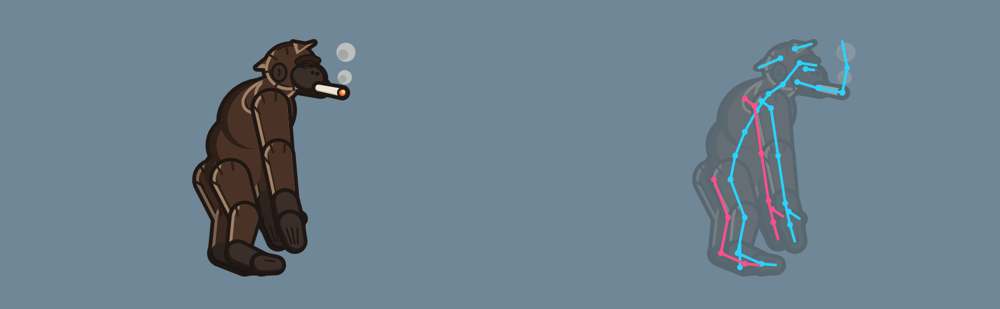

# Scheletro dei lottatori

Come sono costruiti i lottatori animati a pezzi (cutout) e come si passa allo scheletro più ricco (#195). Vale per Bonobot ed è il modello per gli altri. Lo stile dei disegni è in [stile-grafico.md](stile-grafico.md).

**Stato:** proposta di Riccardo (@GiovannifRana). Lo scheletro nuovo non cambia il gioco: in Blender si anima come oggi e si esporta lo spritesheet. Se il gruppo approva la proposta [#196](https://github.com/nicpanozzo/bonobo-game/issues/196), lo stesso scheletro si potrà animare direttamente in Godot.

## Perché più ossa

Oggi Bonobot ha 18 pezzi su 19 ossa: il busto si piega in un punto solo e mani e piedi sono blocchi unici. Con 35 ossa che deformano:

- il busto si piega in **tre segmenti**, con il collo a parte: respiro, rincorsa e colpi hanno una curva vera, non una cerniera;
- **mani** con dita e pollice e **piedi** con dita: le nocche si appoggiano nella corsa e il piede rulla nel passo;
- **faccia** con mascella, sopracciglio e palpebra: sbattere le ciglia, alzare il sopracciglio, la canna che si muove con la bocca;
- **ciuffi**, canna e fumo seguono i movimenti in ritardo (inerzia), senza animarli a mano;
- le catene di braccia e gambe hanno la **cinematica inversa (IK)**: si sposta la mano o il piede e gomito e ginocchio seguono, così mani e piedi restano piantati a terra.

## Le ossa

Tutte le ossa sono in [`rig.json`](../public/assets/characters/bonobot/rig/rig.json), con la posizione a riposo di testa e coda. `R` è il lato vicino a chi guarda, `L` quello lontano.

| Gruppo | Ossa |
|---|---|
| Corpo | `root` (ai piedi) → `hips` → `spine_1` → `spine_2` → `spine_3` → `neck` → `head` |
| Testa | `jaw` → `joint` (canna) → `smoke_1` → `smoke_2`; `brow`, `lid`, `tuft_back`, `tuft_front` |
| Braccia (×2) | `clavicle` → `upper_arm` → `forearm` → `hand` → `fingers`, `thumb` |
| Gambe (×2) | `thigh` → `shin` → `foot` → `toes` |
| Controlli (non deformano) | `ik_hand_R/L`, `ik_foot_R/L` (dove va la mano o il piede), `pole_arm_R/L`, `pole_leg_R/L` (da che parte si piegano gomito e ginocchio) |

Totale: 35 ossa che deformano più 8 controlli.

## Convenzioni

- **Coordinate del disegno:** pixel a 2x, origine ai piedi al centro, y in giù, il personaggio guarda a destra. Nel gioco si mostra a metà (`scale: 0.5`).
- **Nomi:** in inglese, `snake_case`, lato in fondo (`_R` vicino, `_L` lontano). Ogni pezzo porta il nome del suo osso.
- **Un pezzo per osso, al massimo.** Il pezzo copre la giuntura con una forma tonda, così ruotando non si apre un buco.
- **Contorno a inchiostro in un livello a parte:** ogni pezzo ha `nome.png` (colori) e `nome_ink.png` (sagoma nera un po' più grande).
  - I pezzi del corpo e del lato lontano mettono il contorno in un livello comune dietro a tutto. Così il personaggio ha **una sola sagoma esterna** e nel busto non si vedono giunture.
  - Braccio e gamba vicini, sopracciglio, palpebra e canna hanno il **contorno proprio**, subito dietro al pezzo, perché passano davanti al corpo.
  - In `rig.json`: `inkZ` -100 è il contorno comune, `z - 0.5` quello proprio.
- **Ombre:** due toni con luce da davanti in alto, come dice la guida. I segmenti del busto hanno l'ombra solo sul dorso, per non disegnare archi dove si sovrappongono.
- **Rotazioni nel piano:** in Blender le ossa ruotano solo attorno al loro asse Z, che guarda la camera. Le altre assi sono bloccate per non uscire dal 2D per sbaglio. Visto dalla camera, un angolo positivo in Blender è antiorario.

## I file

| File | Cosa |
|---|---|
| `public/assets/characters/bonobot/rig/rig.json` | ossa, gerarchia, catene IK e pezzi (immagine, posizione, livello) |
| `public/assets/characters/bonobot/rig/pezzi/` | i 32 pezzi: PNG a 2x per colori e inchiostro, più il sorgente SVG |
| `tools/rig/genera_pezzi_bonobot.py` | rifà pezzi, `rig.json` e tavola dai disegni nel codice. Serve finché i pezzi sono provvisori, poi si disegnano in Krita |
| `tools/blender/costruisci_rig.py` | in Blender crea da `rig.json` l'armatura, un piano per pezzo appeso al suo osso, le IK e la camera |
| `tools/blender/esporta_animazioni.py` | scrive le azioni di Blender in un JSON di chiavi per osso, con le IK già calcolate. Serve alla proposta #196 |

## Come si usa in Blender (4.2)

1. **Costruire la scena:**
   `blender --background --python tools/blender/costruisci_rig.py -- public/assets/characters/bonobot/rig bonobot_rig.blend`
   Si può anche aprire lo script nel pannello Scripting e premere Esegui. Lo script sceglie da solo l'angolo del polo delle IK che lascia la posa a riposo identica.
2. **Animare:**
   - una **azione per stato**, con i nomi di `characters.ts` (`idle`, `walk`, `light`...);
   - braccia e gambe si muovono spostando i controlli `ik_*`, il resto ruotando le ossa;
   - a 24 fps, con i tempi dei colpi di `ATTACKS`, come dice la guida.
3. **Esportare lo spritesheet:** con `esporta_spritesheet.py`, come oggi, adattato al formato a cartella (un PNG per stato, E7 passo 4).
4. **Solo per la proposta #196:**
   `blender bonobot_rig.blend --background --python tools/blender/esporta_animazioni.py -- animazioni.json`

**Provato nel cloud** con `bpy` 4.2:
- la scena si costruisce e le IK lasciano la posa a riposo identica;
- una rotazione della testa e uno spostamento della radice e del piede escono giusti nel JSON;
- il render con Cycles mostra i pezzi al loro posto.

## Portare il `.blend` di Bonobot sul nuovo scheletro

Il `.blend` di oggi sta sul PC di Riccardo, con 19 ossa e le sue azioni. Ci sono due strade:

1. **Ripartire dalla scena nuova** (consigliata). Si costruisce la scena con lo script e si rifanno le azioni sullo scheletro nuovo, prendendo le vecchie come riferimento, magari in trasparenza dietro.
2. **Aggiungere le ossa alla scena vecchia.** Si dividono busto, mani e piedi nel `.blend` di oggi, rinominando le ossa come in `rig.json`. Si tengono le azioni, ma vanno ritoccate dove le ossa si dividono.

I disegni dei pezzi sono **provvisori**, fatti col codice. Quando arrivano quelli definitivi da Krita basta sostituire i PNG con lo stesso nome e la stessa misura, oppure aggiornare `x`, `y`, `width` e `height` in `rig.json`. Le animazioni restano.
