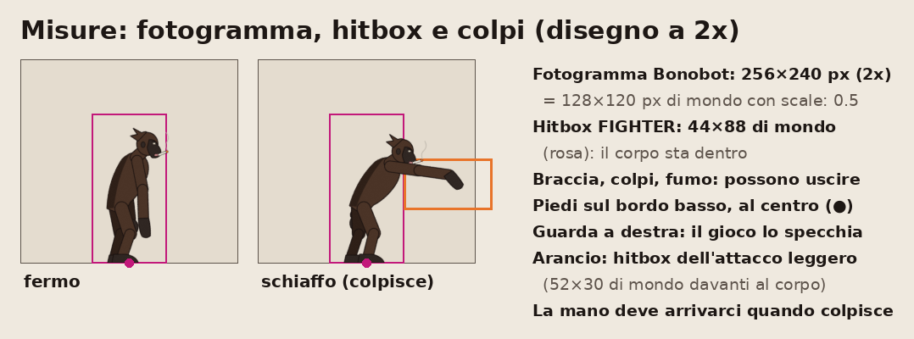
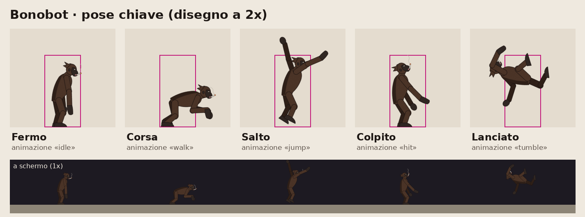

# Stile grafico di Bonobo Game

La guida per chi disegna lottatori e arene. Serve a far uscire ogni personaggio nello stesso stile e a farlo arrivare nel gioco senza toccare il codice.

**Stato:** proposta di Riccardo (@GiovannifRana), scritta con il passo 1 di E7 ([#41](https://github.com/nicpanozzo/bonobo-game/issues/41), [specifica](evolutive/E7.md)). Diventa la regola dopo il voto del gruppo (vedi [Voto](#voto-del-gruppo) in fondo). Il personaggio di riferimento è **Bonobot** (`public/assets/characters/bonobot/`).

## 1. Tecnica: 2D illustrato

- **Come Brawlhalla:** disegni 2D illustrati, proporzionati e poco cartoon, con linea pulita e ombre a due toni.
- **Niente pixel art:** la camera zooma (`CAMERA.minZoom` 0.7, `maxZoom` 1.3 in `constants.ts`) e la pixel art si scala male; i volti, che contano nei ritratti, si perdono.
- **Niente 3D:** troppo lavoro per un gruppo di amici e per un gioco che gira nel browser.
- **Eccezione:** Capt. OrsoBlu (#40, prima si chiamava Egiainuso) è in pixel art 64×96 ed è un esempio provvisorio. Ridisegnarlo o tenerlo come eccezione si decide con @MauroGrecchi.

## 2. Linea, ombre e colori

- **Contorno a inchiostro** scuro (quasi nero, non nero puro) attorno a ogni pezzo, di spessore costante: circa 3 px nel disegno a 2x.
- **Ombre piatte a 2 toni:** un tono base e un'ombra, con il bordo netto. Niente sfumature, niente texture, niente luce realistica. La luce viene da davanti in alto: l'ombra cade sul dorso e sotto.
- **Colori alla Hades:** pochi accenti saturi su una base più quieta. Ogni personaggio ha **2-3 colori propri**, riconoscibili da lontano.
- **Leggibilità sui fondali scuri:** un personaggio molto scuro (come il pelo di Bonobot) prende un sottile **contorno luminoso** sulla sagoma, oppure un *chroma* più chiaro da scegliere in selezione. Prova: lo screenshot in scala di grigi deve mostrare la sagoma staccata dal fondale.

### Colori riservati ai giocatori

Il colore del giocatore **non tinge mai lo sprite**: sta sull'indicatore sopra la testa, sull'alone ai piedi e nell'HUD. Per questo i colori dei giocatori non vanno usati saturi come colore principale di un personaggio né vicino al piano di gioco delle arene:

| `COLORS` | rosso `#e74c3c`, blu `#3498db`, verde `#2ecc71`, giallo `#f1c40f`, viola `#9b59b6`, arancio `#e67e22`, turchese `#1abc9c`, rosa `#ff6fb5` |
|---|---|
| `COLORS_COLORBLIND` | `#d55e00`, `#0072b2`, `#009e73`, `#f0e442`, `#cc79a7`, `#e69f00`, `#56b4e9`, bianco |

Usati poco, come piccoli accenti (una brace, un bottone), vanno bene.

## 3. Personaggi

- **Corpi proporzionati,** niente testa gigante.
- **Personaggi = noi** (#13): caricatura leggera, volto molto somigliante con un piccolo accento sui tratti tipici. Nome, faccia e voce di una persona entrano nel gioco solo se quella persona è d'accordo.
- **Riconoscibili da lontano:** a zoom minimo il volto non si vede, quindi contano sagoma, capelli, un capo d'abbigliamento o un oggetto simbolo. Il volto si vede nei ritratti (HUD, selezione, vittoria).
- **Test della sagoma:** riempito tutto di nero, il personaggio si distingue dagli altri del roster.

## 4. Misure rispetto alla hitbox



- La hitbox di gioco è `FIGHTER` in `constants.ts`: **44×88 px di mondo**. Lo sprite è solo grafica: non cambia la hitbox.
- **Il corpo sta dentro la hitbox;** braccia, colpi, capelli, fumo e oggetti possono uscire.
- **Piedi sul bordo basso del fotogramma, al centro** (lì il gioco mette `x` e `y` del lottatore). **Guarda a destra:** per l'altra direzione il gioco specchia il fotogramma.
- **Fotogramma:** tutti della stessa misura, sfondo trasparente. La misura la sceglie chi disegna, abbastanza larga per i colpi: E7 propone 96×112 px di mondo; Bonobot usa **128×120** perché ha le braccia lunghe.
- **I colpi arrivano dove colpiscono:** nei fotogrammi in cui la hitbox dell'attacco è accesa (`startupMs` e `activeMs` di `ATTACKS`), la mano o l'arma deve stare dentro la sua area (in arancio nella tavola). Sono le stesse aree che Godot disegna durante il colpo e nel pannello dell'allenamento.

## 5. Risoluzione: si disegna a 2x

- Si disegna al **doppio** della misura di mondo e nello spritesheet si scrive `scale: 0.5` (`SpriteSheetSpec` in `characters.ts`). Bonobot: fotogrammi da 256×240 px nel PNG, 128×120 nel gioco.
- **Perché:** a 1080p con lo zoom massimo (1.3) un lottatore occupa circa 170 px sullo schermo; disegnato a 1x si sgrana.
- File singoli **sotto i 5 MB**; Bonobot con 11 animazioni pesa circa 1,6 MB.

## 6. Animazione a pezzi (cutout)



- **Tecnica:** il personaggio è diviso in pezzi (testa, busto, braccio, avambraccio, mano...) appesi a uno scheletro. Si anima ruotando le ossa e si esporta lo spritesheet. Quando arriva il disegno definitivo si sostituiscono le immagini dei pezzi e le animazioni restano.
- **Strumento: Blender** (gratis). Bonobot è fatto così: un piano per pezzo su un'armatura di 19 ossa, un'azione per animazione, e nel file lo script `esporta_spritesheet.py` che rifà il PNG. Il `.blend` di Bonobot per ora sta sul PC di Riccardo; se metterlo nella repo come sorgente si decide con il gruppo.
- **Movenze naturali, non meccaniche:** anticipo prima dei colpi, inerzia (testa, mani e capelli arrivano un attimo dopo il corpo), piedi e mani che restano piantati a terra mentre il corpo si muove, archi nei movimenti.
- **Velocità:** 24 fotogrammi al secondo; le animazioni lente in ciclo (fermo, appeso) possono stare a 12.
- **Colpi a tempo:** negli attacchi si segna `hitFrame`, il fotogramma dell'impatto; il gioco lo fa cadere quando la hitbox si accende.
- **Animazioni obbligatorie** (`AnimationName`): `idle`, `walk`, `jump`, `fall`, `light`, `heavy`, `hit`.
- **Facoltative** (`OptionalAnimationName`; senza si usa quella di ripiego): `doubleJump` (→ `jump`), `tumble` (→ `hit`), `ledge` e `climb` (→ `jump`), `land` e `taunt` (→ `idle`), le varianti degli attacchi (→ `light` o `heavy`)... L'elenco completo è nel [README dei personaggi](../public/assets/characters/README.md).
- **Formato:** una cartella per personaggio con **un PNG per stato** (`idle.png`, `walk.png`...), fotogrammi in fila da sinistra; nel blocco del personaggio in `characters.ts` si scrivono solo `fps` e ciclo di ogni stato. Il vecchio formato a foglio unico (una riga per animazione, come Bonobot oggi) funziona ancora. Istruzioni: `public/assets/characters/README.md`.

## 7. Arene

Ogni arena ha la sua palette e il suo luogo (#14), con tre regole comuni:

1. **Fondale più spento e più scuro dei personaggi.** Prova: screenshot in scala di grigi, i lottatori devono staccarsi.
2. **Bordo calpestabile sempre chiaro**, così si capisce dove si può stare.
3. **Niente colori dei giocatori saturi vicino al piano di gioco** (vedi la tabella sopra).

## 8. Prima di mandare un personaggio: checklist

- [ ] Stile: contorno a inchiostro, 2 toni, 2-3 colori propri, nessun colore dei giocatori come colore principale.
- [ ] Sagoma nera riconoscibile; si legge sul fondale scuro e in scala di grigi.
- [ ] Disegnato a 2x, `scale: 0.5`; fotogrammi tutti uguali, trasparenti, piedi al centro del bordo basso, guarda a destra.
- [ ] Corpo dentro 44×88 di mondo; nei colpi la mano arriva nell'area dell'attacco nei fotogrammi giusti.
- [ ] Le 7 animazioni obbligatorie; le facoltative se ci sono.
- [ ] PNG sotto i 5 MB, riga in `public/assets/CREDITS.md` (autore, fonte, licenza), il consenso della persona ritratta.
- [ ] `npm run export:godot`, poi provato in Godot (`godot --path godot -- --room=prova --name=A --char=<id>`).

## Riferimenti

Brawlhalla (tecnica, proporzioni, camera) e Hades (palette, inchiostro, ombre piatte). Sono materiale protetto da copyright: si citano e si guardano, **non si mettono nella repo**.

## Voto del gruppo

Il passo 1 di E7 si chiude con il voto del gruppo, linkato nella #41. Sondaggio proposto (24 ore), da lanciare con il permesso di Riccardo:

```bash
npm run discord -- poll "Stile grafico di Bonobo Game: va bene la proposta in docs/stile-grafico.md (2D illustrato alla Brawlhalla, colori alla Hades, animazione a pezzi)?" "Sì, così" "Sì, con qualche modifica (scrivete nella #41)" "No, un'altra direzione"
```
